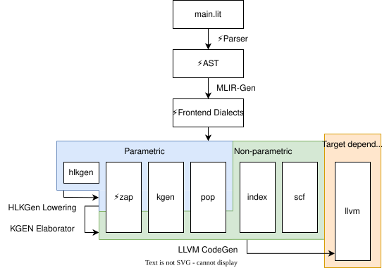

# Mojo / KGEN ⚜️: Kernel Generator Infrastructure

This is the main documentation for the "KGEN ⚜️" kernel generator infrastructure.
KGEN allows defining parametric kernel generators with multiple implementations
and uses search to find the best implementation for a given hardware and
use-case.  This is a novel approach to tackle the age old divide between hand
written kernels and "ML compilers".

## Dialect Layering

KGEN has several dialects: `lit`, `kgen`, `pop`, and `hlcf`. KGEN IR also
uses the upstream `index`, and `llvm` dialects.  The `lit` dialect should more
properly be named `mojo` perhaps but now reflects how "lit" Mojo is 🔥.

`lit` is a high-level dialect for building kernel libraries.  It is lowered
to `kgen` before elaboration. The `kgen` dialect is the canonical dialect for
describing parametric IR. The dialect defines the parameter system and the
types, attributes, and operations for interacting with parameters.

`hlcf` and `index` are non-parameterized, target-independent dialects that exist
in "KGEN IR" pre-elaboration and post-elaboration. `llvm` is a target-dependent
dialect that can exist at all levels of KGEN IR. However, it locks the
particular kernel to the LLVM target.

`pop` (which stands for "parametric operations") are parameterized,
target-independent dialects used to build parametric kernels.

In summary:

- `lit` exist pre-elaboration. They are lowered to `kgen` and `pop`
before elaboration.
- `pop` exists pre and post elaboration. Operations in the dialect
become non-parametric post-elaboration. They are lowered to `llvm` when
executing kernels.
- `index` and `hlcf` exist pre and post elaboration. They are lowered to `llvm`
when executing kernels.
- `llvm` can exist at all levels of KGEN IR to describe target-specific
operations, but then the kernel can only target LLVM.

## Detailed Documentation

See these breakout docs:

- [Generative Kernel Compiler Design Overview](DesignOverview.md)
- [Generative Kernel Compiler Task List](TaskList.md)
- [Design Rationale](Rationale.md) for details.

For more on Mojo see:

- [Mojo🔥 Notes](MojoNotes.md)
