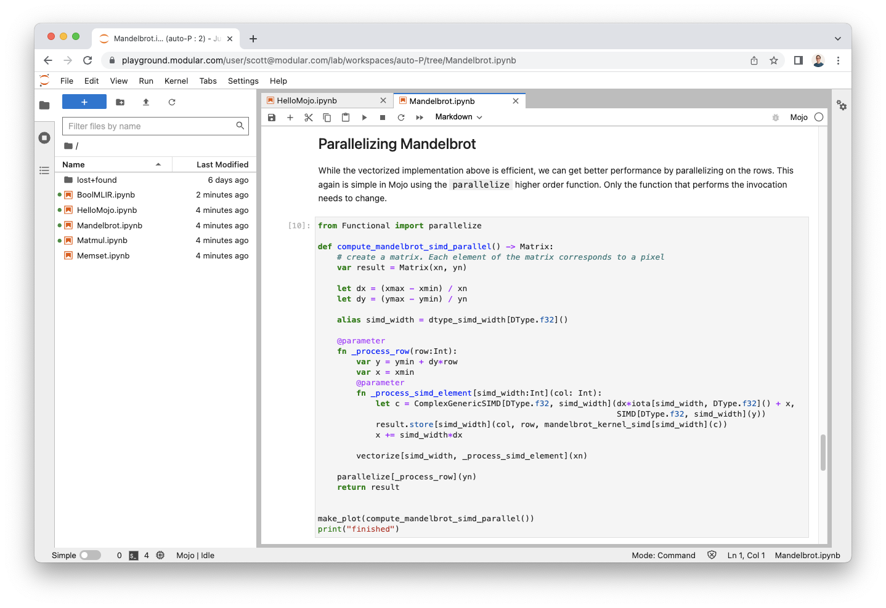

The Mojo language is still very young, but we want your feedback!

The Mojo standard library, compiler, and runtime are not available for
local development yet, so we created a hosted development environment where you
can try it out. We call it the **Mojo Playground**!

To provide the best experience possible, the Mojo Playground currently supports
a limited number of people. We plan to scale up quickly so everybody can get
access over time.

{.screenshot}

## Get started

1. [Sign up for access to the Mojo
    Playground](https://www.modular.com/get-started/).

2. When you receive access, [log in to the Mojo
    Playground](https://playground.modular.com) using the email
    address you provided in the above form.

3. Share feedback, ideas, issues, or just chat with other users in our
    [Mojo community](/mojo/community.html). Also feel free to share
    your Mojo code with others.

## What to expect

+ The Mojo Playground is a [JupyterHub](https://jupyter.org/hub) environment in
which everybody has access to the same Mojo standard library, but each user has
a private volume in which you can write and save your own Mojo programs.
+ We've included a handful of notebooks to show you Mojo basics and demonstrate
its capabilities. The first one, "Hello, Mojo," is a walkthrough of all
the major language features. (If you don't have access yet, you can read the
[rendered notebooks here](/mojo/notebooks/).)
+ The number of vCPU cores available in your cloud instance may vary, so
baseline performance is not representative of the language. However, as you
will see in the [`Matmul.ipynb`](/mojo/notebooks/Matmul.html) notebook, Mojo's
relative performance over Python is significant.
+ There might be some bugs. Please [report issues and feedback on
GitHub](https://github.com/modularml/mojo/issues).

## Tips

+ **Rename the included notebooks** if you make any changes. These files will
reset upon any server refresh or update, sorry. So if you rename the files,
your changes will be safe.
+ You can use `%%python` at the top of a notebook cell and write normal Python
code. Variables, functions, and imports defined in a Python cell are available
for access in future Mojo cells.

## Caveats

+ Did we mention that the included notebooks will lose your changes? 
**Rename the files if you want to save your changes.**
+ The Mojo environment does not have network access, so you cannot install
other tools or Python packages. However, we've included a variety of popular
Python packages, such as `numpy`, `pandas`, and `matplotlib` (see how to
[import Python modules](/mojo/programming-manual.html#python-integration)).
+ Redefining implicit variables is not supported (variables without a `let` or
`var` in front). If you’d like to redefine a variable across notebook cells,
please introduce the variable with either `let` or `var`.
+ You can’t use global variables inside functions - they’re only visible to
other global variables.
+ For a longer list of things that don't work yet or have pain-points, see the
[Mojo roadmap and sharp edges](/mojo/roadmap.html).
