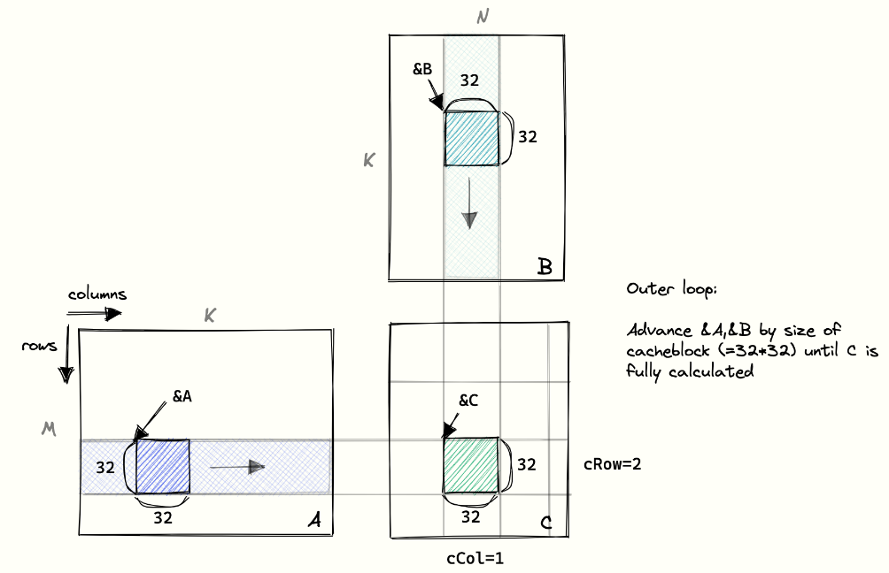
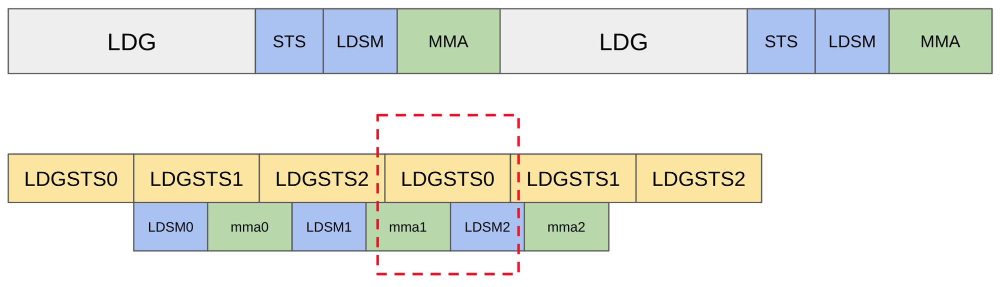
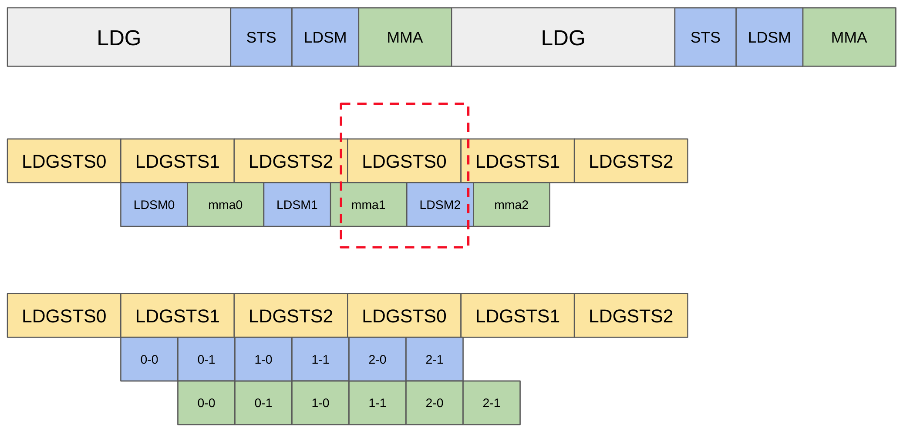
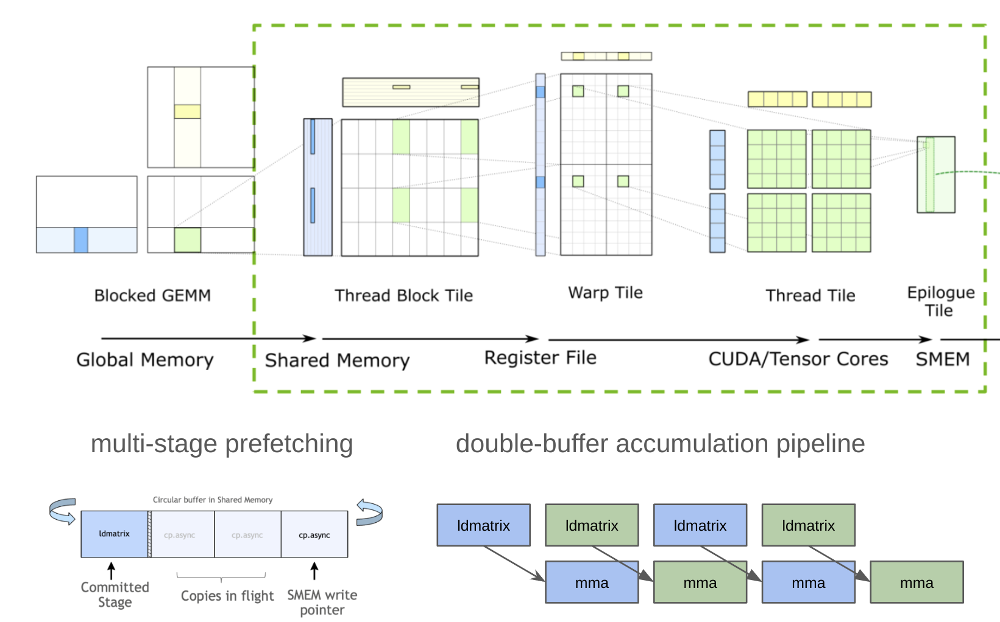
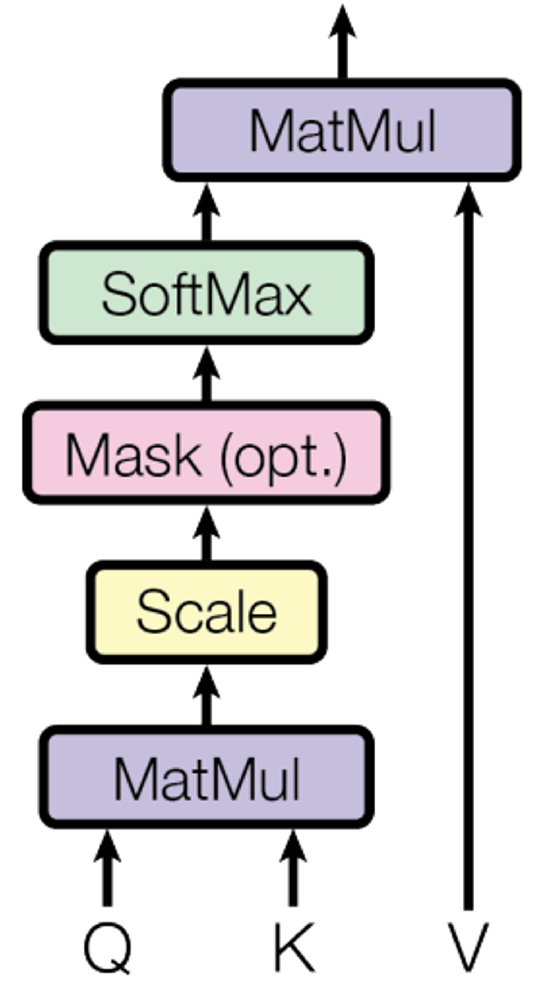
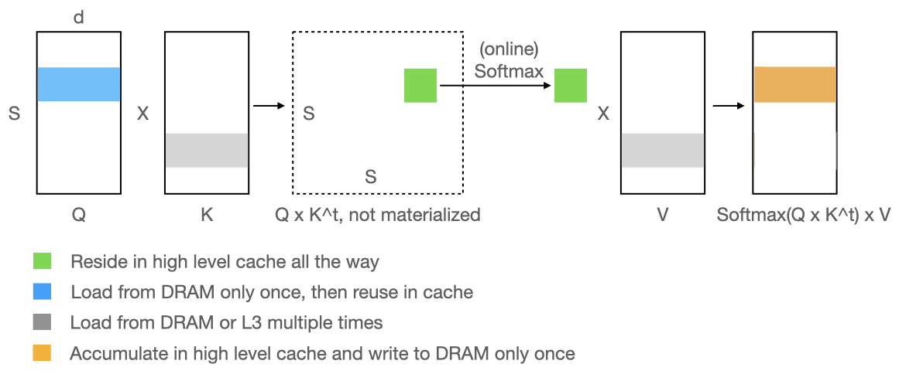
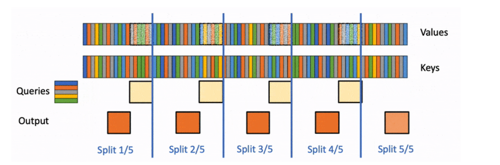
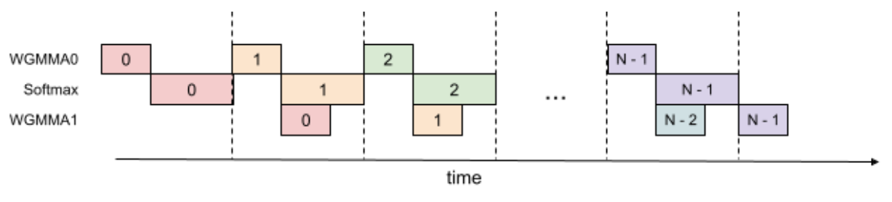

# Matmul to Flash Attention

- **Author:** Hengjie Wang
- **Date:** August 6, 2024

In this article, we describe how the implementation of Flash Attention can be
understood within the context of fast matrix multiplication for Ampere
hardware. By taking advantage of new asynchronous data transfer instructions,
data transfer overhead can be hidden by the computation within a single thread
block through pipelined execution. Compared to matrix multiplication,
Flash Attention addresses the global data dependence incurred by `softmax` via
tiling and running statistics.

## How to write a fast `matmul` on Ampere

We begin with a discussion about how to write a fast `matmul` kernel on Ampere
hardware, drawing from the very good overview, "[How to Optimize a CUDA Matmul
Kernel for cuBLAS-like Performance: a
Worklog](https://siboehm.com/articles/22/CUDA-MMM)," by [Simon
Boehm](https://siboehm.com/about/).

### Baseline shared memory matmul

We begin with a baseline implementation of shared memory `matmul`. The outer
loop of the multiplication advances the address of the row-major matrix `A` and
the column-major matrix `B` by a tile size until the final matrix `C` is fully
calculated.


<!-- rumdl-disable MD013 -->
/// caption
Baseline implementation of shared memory `matmul`. Source
[Boehm, Simon](https://siboehm.com/articles/22/CUDA-MMM).
///
<!-- rumdl-enable MD013 -->

Each thread block loads tiles from `A` and `B` into shared memory and
multiplies the sub-matrices.

The following view-construction fragment uses native shared storage. It belongs
inside a GPU kernel; the global input buffers must remain alive throughout
the launch.

```mojo
from layout import TileTensor, row_major, stack_allocation

comptime tile_size = 32
var a_smem_tile = stack_allocation[
    DType.bfloat16, address_space=.SHARED
](row_major[tile_size, tile_size]())
var b_smem_tile = stack_allocation[
    DType.bfloat16, address_space=.SHARED
](row_major[tile_size, tile_size]())
```

The accumulation schedule below is conceptual. Global tile loading must assign
non-overlapping elements to threads and handle boundary tiles; it is not a
`TileTensor.copy()` method.

```text
accum = 0
for k in range(0, K, tile_size):
    load_global_tiles_into(a_smem_tile, b_smem_tile, k)
    block_barrier()
    for kk in range(tile_size):
        accum += a_smem_tile[i, kk] * b_smem_tile[kk, j]
    block_barrier()
```

### Why is it slow?

This baseline implementation has two key blockers to performance improvements.

- We are not using tensor cores.
- ***The barrier prevents us from overlapping data transfer and
  computation***.


/// caption
Strict serial ordering of load, store, and accumulation operations.
///

We added tensor core matrix multiply-accumulate (mma). As a consequence of the
barrier synchronization, four sets of instructions have to be executed in
strict serial order for each thread block.

1. **LDG**: load from global memory to registers
2. **STS**: store registers to share memory
3. **LDSM**: load from shared memory to register for tensor core accumulation.
4. **MMA**: tensor core accumulation using register values.

***Each thread block wastes computation resource while transferring data,
and vice versa.***

## Overlap computation and global memory access

To address these performance issues, the Nvidia Ampere architecture introduced
new asynchronous data transfer instruction, LDGSTS.

- The synchronous load from global memory to shared memory has two
  ***implicit*** steps:
  - `LDG,     registers,    [global_memory_address]`
  - `STS,     [shared_memory_address],    registers`
- In comparison, asynchronous transfer is ***one*** instruction and ***does
  not*** use registers.
  - `LDGSTS    [shared_memory_address],    [global_memory_address]`

This design relieves register pressure and allows for better overlap with
computation.

### How do we overlap?

The key insights are to:

- Maintain multiple buffers to resolve the RAW, WAR data dependence.
- Pipeline computation and data transfer.

Allocate shared ring storage with `stack_allocation()`, and create borrowed
`TileTensor` views of each stage. The allocation and views remain within the
kernel's lifetime. The caller maintains the stage index explicitly; there is
no generic `TileTensorIter` replacement for the legacy circular iterator.

```mojo
from layout import TileTensor, row_major, stack_allocation

# NUM_STAGES and TILE_SIZE are compile-time kernel configuration values.
var a_ring = stack_allocation[DType.bfloat16, address_space=.SHARED](
    row_major[NUM_STAGES, TILE_SIZE, TILE_SIZE]()
)
var b_ring = stack_allocation[DType.bfloat16, address_space=.SHARED](
    row_major[NUM_STAGES, TILE_SIZE, TILE_SIZE]()
)
var stage = 0
var a_stage = TileTensor[address_space=.SHARED](
    a_ring.unsafe_ptr() + stage * TILE_SIZE * TILE_SIZE,
    row_major[TILE_SIZE, TILE_SIZE](),
)
var b_stage = TileTensor[address_space=.SHARED](
    b_ring.unsafe_ptr() + stage * TILE_SIZE * TILE_SIZE,
    row_major[TILE_SIZE, TILE_SIZE](),
)
```

The following schedule is conceptual, not a callable iterator API. Its copy,
commit, and wait operations represent the kernel's cooperative copy protocol.
For native distributed copy fragments, `destination.copy_from_async(source)`
is an available operation; there is no `.async_copy()` method on a stage view.
The kernel must choose thread ownership, copy bounds, committed-group waits,
and barriers that prevent reuse before all readers finish. Allocation alignment
must match the selected vectorized asynchronous-copy width: the BF16 default
alignment does not promise 16-byte alignment. These view-construction fragments
do not by themselves provide a copy-ready numerical kernel.

```text
for write_stage in range(num_pipeline_stages - 1):
    enqueue_global_to_shared_copy(write_stage)
commit_and_wait_for_first_stage()
block_barrier()

read_stage = 0
for k in range(0, K, tile_size):
    load_registers_and_accumulate(stage_view(read_stage))
    ensure_all_stage_readers_finished()
    write_stage = (read_stage + num_pipeline_stages - 1) % num_pipeline_stages
    if another_global_tile_is_available():
        enqueue_global_to_shared_copy(write_stage)
    commit_and_wait_for_next_stage()
    block_barrier()
    read_stage = (read_stage + 1) % num_pipeline_stages
```

Example of 3 pipeline stages:


<!-- rumdl-disable MD013 -->
/// caption
Pre-fetching data concurrently with accumulation operation.
///
<!-- rumdl-enable MD013 -->

## Overlap computation and shared memory access

Similar to overlap global memory access, we pipeline LDSM and MMA. Two stages
are typically good enough in practice.

2-stages pipeline (double-buffer) for shared memory transfer and computation.

3-stages pipeline for global memory transfer and computation.


<!-- rumdl-disable MD013 -->
/// caption
Pipelines for global and shared memory transfer and computation.
///
<!-- rumdl-enable MD013 -->

Note how within both 2-stage and 3-stage pipelines, the global memory transfer
to shared memory (`LDGSTS`) for future computation happens concurrently with
the loading from shared memory (`LDSM`) and accumulation (`MMA`) operations.
The following figure illustrates the pipeline execution with matrix tiling and
architecture hierarchy.


<!-- rumdl-disable MD013 -->
///caption
Matrix view of fast multiplication. Source
[cutlass](https://github.com/NVIDIA/cutlass).
///
<!-- rumdl-enable MD013 -->

### Split-K

Recap: we partition M and N dimension to create sub-matrices for thread blocks.


<!-- rumdl-disable MD013 -->
/// caption
Recap - baseline implementation of shared memory `matmul`. Source
[Boehm, Simon](https://siboehm.com/articles/22/CUDA-MMM).
///
<!-- rumdl-enable MD013 -->

What happens when M and N are small? E.g. M = 64, N = 3072, K = 3072, and
tile_size = 128 ==> 24 thread blocks. We are using < 25% SMs on A100 (108 in
total).

We need to partition the K dimension to create more tasks.

E.g. M = 64, N = 3072, K = 3072, split K into 2 partitions

This partitioning sketch is conceptual; launch arguments and workspace views
depend on the selected kernel.

```text
# Given global A, B, C buffers.
if ceildiv(M, BM) * ceildiv(N, BN) < 0.8 * num_SMs:

  # Each partition updates a separate copy of C.
  # E.g. 2 partitions need 2 buffers with the same shape of C.
  var work_space = ctx.create_buffer[...](num_K_partitions * C.size())

  # Matmul updates its corresponding partitions.

  # Write result of K 0:1536 to work_space [0:64, 0:N]
  # write result of K 1536:3072 to work_space [0: 64, N:2*N]
  ctx.enqueue_function(matmul(A, B, work_space, num_K_partitions))

  # Sum work_space: [0:64, 0:N] + [0: 64, N:2*N].
  ctx.enqueue_function(split_k_reduction(C, work_space, num_K_partitions))
```

## Flash Attention

With these optimizations in mind, we can now consider the implementation of
Flash Attention.

### Multi-head attention block

We begin with a brief overview of multi-head attention:

[Multi-Head Attention](https://www.notion.so/Multi-Head-Attention-bbc2d300937a495da40c18b6a2028d22?pvs=21)

`Q`, `K`, and `V` in our stack have shape `[B, S, H, D]`, where:

- `B`: batch size
- `S`: sequence/context length (`matmul dim`)
- `H`: number of heads (similar to `B`)
- `D`: depth (`matmul dim`)

The following sketches show tensor algebra, not callable Mojo fragments.

```text
# Per matmul, Q, K have shape [S, D]
batch_matmul(P, Q, K, transpose=True)
P = P * scale + mask
P = softmax(P)
# Per matmul, P: [S, S], V: [S, D]
batch_matmul(output, P, V)
```

{width="300"}
<!-- rumdl-disable MD013 -->
/// caption
Multi-head attention block
///
<!-- rumdl-enable MD013 -->

For example, with Replit-3B, assuming an input sequence `length = 1000`.

- context encoding,
  - `Q: [B, 1000, 24, 128]`,
  - `K` and `V: [B, 1000, 8, 128]`,
  - `P: [B, 24, 1000, 1000]`
- i-th token generation,
  - `Q: [B, 1, 24, 128]`,
  - `K` and `V: [B, 1000 + i, 8, 128]`,
  - `P: [B, 24, 1, 1000+i]`

*Note: sequence length (for Q) and context length for (K, V) are two separate
dims.*

The above materializes a S x S intermediate matrix (for context
encoding), which introduces huge memory usage and traffic for long
sequences.

### Flash Attention algorithm

Flash Attention is an algorithm that optimizes the computation of multi-head
attention by addressing the memory bottleneck that occurs when computing the
attention matrix `P` (of size `S×S` for context encoding, where `S` is sequence
length). Instead of materializing the entire attention matrix in memory at once,
Flash Attention uses a tiling approach where it processes small chunks of
queries, keys, and values sequentially, computing attention scores and applying
`softmax` in an "online" manner within each tile.

The key innovation is the online softmax technique that maintains running
statistics (row maximum and row sum) across tiles, allowing it to compute
numerically stable `softmax` without needing the entire row of attention
scores. This approach delivers significant performance gains by dramatically
reducing memory usage and memory traffic—eliminating the need to store the
large `S×S` intermediate matrix that grows quadratically with sequence
length—while maintaining mathematical equivalence to the standard attention
computation.


/// caption
Flash attention
///
One of the primary challenges for implementing flash attention is how to
compute a numerically stable softmax for a small tile.

For full tiles, native global views can be constructed from borrowed scalar
pointers and tiled without introducing an owning copy. In this fragment,
`NUM_KEYS`, `DEPTH`, and `KV_TILE_SIZE` are compile-time sizes; the pointer
owners must outlive the kernel, and ragged tails require a separate bound or
masking policy.

```mojo
from layout import TileTensor, row_major

var k_global = TileTensor(k_ptr, row_major[NUM_KEYS, DEPTH]()).as_imm()
var v_global = TileTensor(v_ptr, row_major[NUM_KEYS, DEPTH]()).as_imm()
var k_tile = k_global.tile[KV_TILE_SIZE, DEPTH](kv_tile_index, 0)
var v_tile = v_global.tile[KV_TILE_SIZE, DEPTH](kv_tile_index, 0)
```

The loop below is conceptual: `mma`, reductions, and tensor arithmetic stand
for the implementation's fragment operations, not `TileTensor` operators.

```text
# Prepared q_tile, p_tile, output_tile

for kv_offset in range(0, num_keys, kv_tile_size):
    # 1st matmul, skip scaling and masking
    k_tile = key_stage_view(kv_offset)
    mma(p_tile, q_tile, k_tile, transpose_b = True)

    # ????????????? How to apply softmax to a p_tile ?????????????????
    # softmax(x): y[i] = exp(x[i]) / sum(exp(x[i]))
    # Prone to overflow and underflow.

    # To avoid overflow
    #   y[i] = exp(x[i] - max(x)) / sum(exp(x[i] - max(x))

    # def softmax(x):
    #   var x_max       = rowmax(x)            # Need the entire row !!!!
    #   var numerator   = exp(x - x_max)
    #   var denominator = rowsum(numerator)    # Need the entire row !!!!
    #   return numerator / denominator
    #
    # ?????????????????????????????????????????????????????????????????

    # 2nd matmul
    v_tile = value_stage_view(kv_offset)
    mma(output_tile, p_tile, v_tile)
```

### Online softmax: break down softmax and blend it with matmul

To address this challenge, for each tile of keys/values, Flash Attention
computes attention scores `Q×K'`, then applies "online softmax" - a technique
that maintains running statistics (`rowmax`, `rowsum`) to compute numerically
stable `softmax` across tiles without needing the full attention matrix.

The key insight is that when a new tile produces a larger maximum value, it
corrects both the running sum and the previous output using an exponential
correction factor, ensuring the final result is mathematically equivalent to
computing softmax over the entire sequence at once. This allows attention to be
computed with constant memory usage regardless of sequence length.

This conceptual recurrence preserves the running statistics and output
rescaling; it does not define a new tensor arithmetic API.

```text
# Prepared q_tile, p_tile, output_tile

var rowmax, rowsum = -inf, 0.0

for kv_offset in range(0, num_keys, kv_tile_size):
    # 1st matmul, skip scaling and masking
    k_tile = key_stage_view(kv_offset)
    mma(p_tile, q_tile, k_tile, transpose_b = True)

    # ===================== Online softmax ======================
    # Find current tile's rowmax and update the record
    current_max = max(rowmax, row_reduce_max(p_tile))
    correction  = exp(rowmax - current_max)
    rowmax      = current_max
    # Softmax numerator for current tile
    p_tile      = exp(p_tile - rowmax)
    # Correct previous sum
    rowsum      = rowsum * correction + row_reduce_sum(p_tile)
    # Correct previous 2nd matmul output
    output_tile = output_tile * correction

    # 2nd matmul
    v_tile = value_stage_view(kv_offset)
    mma(output_tile, p_tile, v_tile)


# Apply softmax's denominator after processing all key/value tiles.
output_tile /= rowsum
```

Creating task for thread blocks:

- Batch and Head dims are independent. (Recap `Q: [B, S, H, D]`)
- Partition sequence length i.e. each thread block updates a `Q` tile.

What about token generation i.e. sequence length = 1?

E.g. `sequence_length = 1`, `batch_size = 1`, `num_heads = 24` -> 24 thread
blocks. We are using < 25% SMs on A100 (108 in total).

The above is mitigated by `batch_size > 1`. Yet, we’re faced with vector matrix
multiplication than matmul, which calls out for additional optimizations.

### Flash Decoding for token generation

- Use more optimized vector matrix multiplication and flat matmul
  (out-of-scope).
- Split-K

PyTorch has a super nice animation for
[flash decoding](https://pytorch.org/blog/flash-decoding/):


/// caption
Flash decoding. Source [PyTorch](https://pytorch.org/blog/flash-decoding/).
///

### Flash Attention 3

Hopper GPU introduces asynchronous warp group mma instructions (wgmma). In
addition to overlapping computation and data transfer, FA3 further pipelines
`wgmma` and `softmax` to overlap ***tensor core*** and ***cuda core***
computation.


/// caption
Flash attention 3
///
